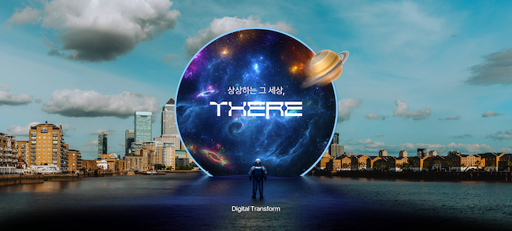

# 테스트용 페이지

책 제목

책 내용

책 끝


<figure><figcaption><p>THERE</p></figcaption></figure>

상상하는 그 세상, THERE


```javascript
	var options = { forceNew: true, secure: true, transports: ['websocket'] };
	var ServerAddr = window.location.protocol + "//" + window.location.hostname + ':' + window.location.port;

	var socket = io.connect(ServerAddr, options);

	socket.on('connect', function() {
		var userLeftMessage = '<p class="text-warning"><em> connect </em></p>';
		appendAndScroll(userLeftMessage);
	});

	socket.on('disconnect', function() {
		var userLeftMessage = '<p class="text-warning"><em> connection is closed .</em></p>';
		appendAndScroll(userLeftMessage);
	});
```


:clap:

## 아아아


흰트를 줄까?





강좌 개설하기

